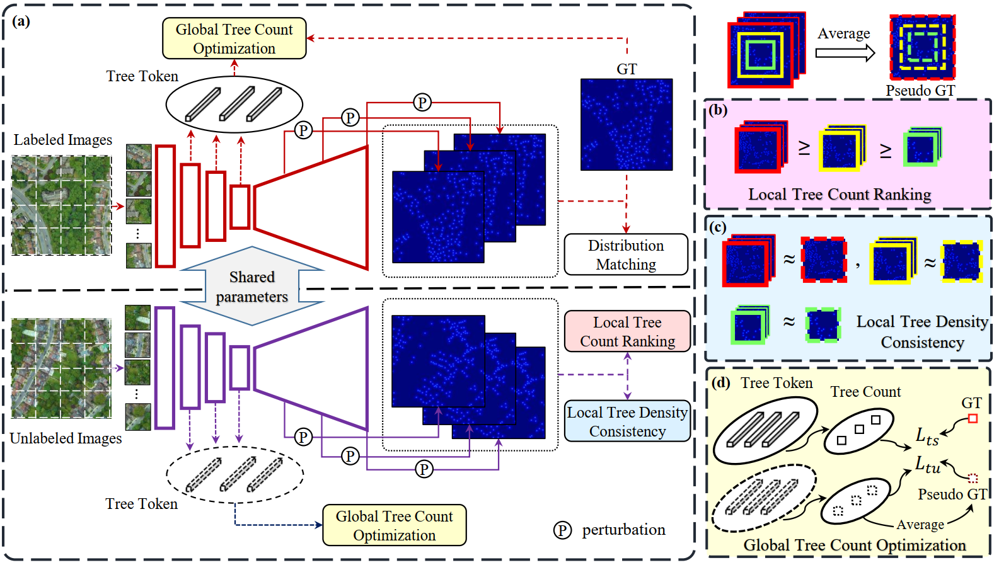

# TreeFormer

This is the code base for IEEE TRANSACTIONS ON GEOSCIENCE AND REMOTE SENSING (TGRS 2023) paper ['TreeFormer: a Semi-Supervised Transformer-based Framework for Tree Counting from a Single High Resolution Image'](https://arxiv.org/abs/2307.06118)



## Installation

Python ≥ 3.7.

To install the required packages, please run:


```bash
  pip install -r requirements.txt
```
    
## Dataset
Download dataset from [google drive](https://drive.google.com/file/d/1288zPMr5Ij7ayk2knFi3_BnLJCDP-8rU/view?usp=sharing).
## Evaluation
Download our trained model on [London](https://drive.google.com/file/d/1hCbLsXi89coM_NsikvjrfxM5eM5vYyv8/view?usp=sharing) dataset.

Modify the path to the dataset and model for evaluation in 'test.py'.

Run 'test.py'
## Acknowledgements

 - Part of codes are borrowed from [PVT](https://github.com/whai362/PVT) and [DM Count](https://github.com/cvlab-stonybrook/DM-Count). Thanks for their great work!
 

